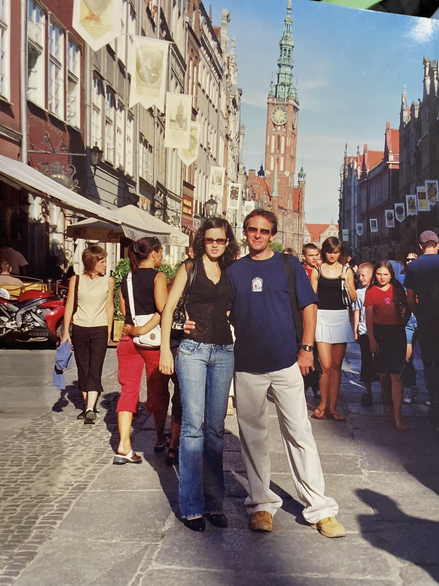

 ## A Framework for Love?

>*"If you spend your time chasing butterflies, they will fly away. But if you spend your time building a beautiful garden, they will come to you. And if they don't, you still have a beautiful garden."*

Love will always be a mysterious concept perhaps I'll never grasp -- it is simple, yet so complex. That's the beauty of love, and we must lie within it.  

One of the most important decisions in our lives will be the person we **marry**. It is detrimental because the right partner can either:

1. Bring you **up**
2. Anchor you **down** 

My father tells me that when you fall in love with your partner, nearly your entire life will revolve around them. Seemingly so, you'll start realzing how much work it truly is. It's a dream that teenagers like me, always found so euphoric: the idea of [[relationships]]. But, we don't truly understand the effort needed to maintain it.

Here is a framework I built for love. Obvously, this is not a 'one size fits all' -- love has no boundaries, perhaps no need for a framework. However, I believe there is an easier way to find your partner, and it starts here:

> Understand who **you** are + understand your [[goals]] --> **eyes** to find the one

This so-called 'framework' that I built was from a surgeon I met when volunteering in the ER. She told me that if you don't understand yourself (your beliefs, personality), how could one possibly be ready for a relationship? 

Understanding one's self also means to love one's self. Therfore, to understand is to also live in **peace** with one's mind, and this is where everything takes off. 

The quote above, stating that you must "spend time building a beautiful garden," literally means to keep pursuing one's goals and aspirations. You must continue to work on yourself, as you'll continue to be a work-in-progress. Once you've come to equal terms with yourself, you will be at peace; physically & mentally. 

I solely believe that the right partner may not be 'perfect' to the rest of the world, but will be perfect in **your eyes**. This is because once you understand your motives, your core values, and most importantly who *you* are, then how can they fit into your life? Do they align with your values? Do they align with your goals? If they don't, it will be hard to force a relationship. 

Like I said, love is a concept I'll never truly grasp. My parents met from mutual friends; both lived in different countries at the time. My father was very much a romantic, and started sending love letters to my mother (the letters were written in polish; my mother is belarussian). The letters were translated to my mother from her friend in university. She sent them back in russian. 

Eventually, they agreed meet in my father's hometown in Poland. The moment they met, he was struck, and went down on one knee.

It's their 20th anniversary this month. 

My father told me that **love is undeniable**. It's this indescribable feeling that warms your soul, bringing everlasting comfort and peace. 

> *"When my friend, at the time, pulled a old photograph out of his jean pocket, there was a woman in the photo. I took a glimpse, and in that very moment, I knew it."*

Love has no boundaries, and I believe we'll never understand it, either. The only thing we can do, in this very moment, is to continue working on ourselves, in order to truly find what we're looking for.

But, if the right person does arrive, it is inevitable. **Love has no boundaries**. 

> 

Modern dating complicates this — see [[Social Media and Relationships]]
